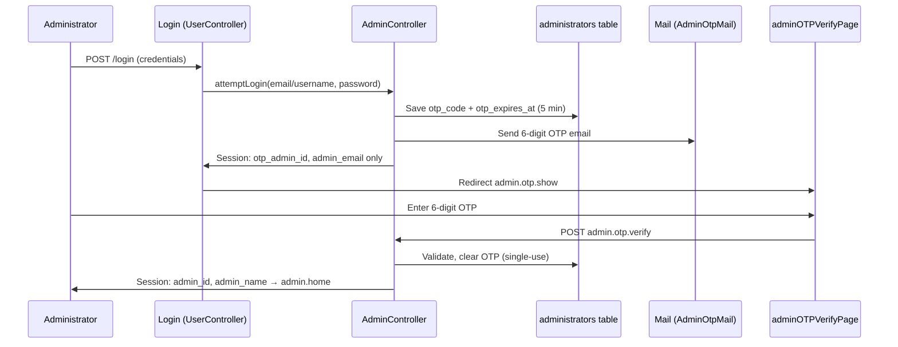

# MCMC AuthenticityHub — Administrator 2FA OTP Implementation

**Project:** MCMC AuthenticityHub (`myApp`)  
**Feature:** Email-based two-factor authentication (2FA) for Administrator login  
**Document:** Technical Report (Sections 2–3 ready for PDF export)  
**Date:** 29 May 2026

---

## Rubric ↔ Actual Implementation Mapping

| Rubric / Assignment Label | Actual Path in Codebase |
|---------------------------|-------------------------|
| `ManageUserController` | `App\Http\Controllers\Module3\Admin\AdminController` |
| `otp-verify.blade.php` | `resources/views/home/adminOTPVerifyPage.blade.php` |
| OTP routes on `ManageUserController` | `Module3AdminController` (`showOtpForm`, `verifyOTP`, `resendOTP`) |
| Module 1 login controller | `App\Http\Controllers\Module1\UserController` |
| Primary app login (Module 3) | `App\Http\Controllers\Module3\PublicUser\UserController` → delegates to `AdminController::attemptLogin()` |
| OTP email template | `resources/views/emails/admin-otp.blade.php` |
| Migration | `database/migrations/2026_05_29_000000_add_otp_columns_to_administrators_table.php` |

---

## Authentication Flow (Summary)



**Security properties:** Full admin session (`admin_id`, `admin_name`) is withheld until OTP verification. OTP is 6 digits, 5-minute expiry, single-use, stored server-side. Partial session keys: `otp_admin_id`, `admin_email`.

---

## 1. DATABASE

**Rubric criterion:** Add `otp_code` and `otp_expires_at` columns to the `administrators` table.

**Migration file:** `database/migrations/2026_05_29_000000_add_otp_columns_to_administrators_table.php`

### BEFORE IMPLEMENTATION

The `administrators` table had no OTP columns. Administrator authentication relied solely on `AdminPassword` verification with immediate session creation.

### AFTER IMPLEMENTATION

```php
<?php

use Illuminate\Database\Migrations\Migration;
use Illuminate\Database\Schema\Blueprint;
use Illuminate\Support\Facades\Schema;

return new class extends Migration
{
    /**
     * Run the migrations.
     * Adds OTP columns to the administrators table for 2FA verification.
     */
    public function up(): void
    {
        Schema::table('administrators', function (Blueprint $table) {
            $table->string('otp_code', 6)->nullable()->after('AdminPassword');
            $table->timestamp('otp_expires_at')->nullable()->after('otp_code');
        });
    }

    /**
     * Reverse the migrations.
     */
    public function down(): void
    {
        Schema::table('administrators', function (Blueprint $table) {
            $table->dropColumn(['otp_code', 'otp_expires_at']);
        });
    }
};
```

**Run migration:**

```bash
php artisan migrate
```

**Model updates** (`App\Models\Module1\Administrator` and `App\Models\Module3\Administrator`):

```php
protected $fillable = [
    // ... existing fields ...
    'otp_code',
    'otp_expires_at',
];
```

| Column | Type | Purpose |
|--------|------|---------|
| `otp_code` | `string(6)`, nullable | Stores current 6-digit OTP |
| `otp_expires_at` | `timestamp`, nullable | Expiry time (5 minutes from generation) |

---

## 2. ROUTING

**Rubric criterion:** Register named routes `admin.otp.show`, `admin.otp.verify`, `admin.otp.resend`.

**File:** `routes/web.php`  
**Controller alias:** `Module3AdminController` → `App\Http\Controllers\Module3\Admin\AdminController`

### BEFORE IMPLEMENTATION

No OTP routes existed. After `logout`, routing continued directly to password recovery:

```php
// Logout
Route::post('logout', [Module3UserController::class, 'logout'])->name('logout');

// Password recovery routes
Route::get('/password/recovery', [Module3UserController::class, 'showRecoveryForm'])->name('password.recovery');
```

### AFTER IMPLEMENTATION

```php
// Logout
Route::post('logout', [Module3UserController::class, 'logout'])->name('logout');

// Admin 2FA OTP Routes
Route::get('/admin/otp-verify', [Module3AdminController::class, 'showOtpForm'])->name('admin.otp.show');
Route::post('/admin/otp-verify', [Module3AdminController::class, 'verifyOTP'])->name('admin.otp.verify');
Route::post('/admin/otp-resend', [Module3AdminController::class, 'resendOTP'])->name('admin.otp.resend');

// Password recovery routes
Route::get('/password/recovery', [Module3UserController::class, 'showRecoveryForm'])->name('password.recovery');
```

| Route Name | Method | URI | Controller Method |
|------------|--------|-----|-------------------|
| `admin.otp.show` | GET | `/admin/otp-verify` | `showOtpForm` |
| `admin.otp.verify` | POST | `/admin/otp-verify` | `verifyOTP` |
| `admin.otp.resend` | POST | `/admin/otp-resend` | `resendOTP` |

---

## 3. CONTROLLER

**Rubric criterion:** Implement OTP logic in admin controller (`attemptLogin`, `showOtpForm`, `verifyOTP`, `resendOTP`) and integrate with the login flow.

**Primary controller (rubric: ManageUserController):** `app/Http/Controllers/Module3/Admin/AdminController.php`  
**Login entry (Module 3):** `app/Http/Controllers/Module3/PublicUser/UserController.php`  
**Parallel Module 1 implementation:** `app/Http/Controllers/Module1/UserController.php`

---

### 3A. Module3 `AdminController` — `attemptLogin`

#### BEFORE IMPLEMENTATION

```php
public function attemptLogin($loginInput, $password)
{
    $admin = Admin::findByLogin($loginInput);

    if ($admin && $admin->checkPassword($password)) {
        // Store admin data in session
        session(['admin_id' => $admin->AdminID, 'admin_name' => $admin->AdminName]);
        return redirect()->route('admin.users');
    }

    return false;
}
```

#### AFTER IMPLEMENTATION

```php
public function attemptLogin($loginInput, $password)
{
    $admin = Admin::findByLogin($loginInput);

    if ($admin && $admin->checkPassword($password)) {
        // ── Step 1: Credentials valid. DO NOT establish full auth session. ──

        // ── Step 2: Generate a secure 6-digit numeric OTP code ──
        $otpCode = str_pad(random_int(0, 999999), 6, '0', STR_PAD_LEFT);

        // Save OTP and expiry (5 minutes) to the database
        $admin->otp_code = $otpCode;
        $admin->otp_expires_at = Carbon::now()->addMinutes(5);
        $admin->save();

        // ── Step 3: Send OTP via email using Laravel Mail Facade ──
        try {
            Mail::to($admin->AdminEmail)->send(new AdminOtpMail($otpCode, $admin->AdminName));
        } catch (\Exception $e) {
            Log::error('Failed to send OTP email to admin: ' . $e->getMessage());
            return redirect()->route('login')
                ->withErrors(['login' => 'Failed to send OTP email. Please try again later.']);
        }

        // ── Step 4: Store ONLY partial identification in session ──
        session([
            'otp_admin_id' => $admin->AdminID,
            'admin_email'  => $admin->AdminEmail,
        ]);

        session()->flash('login_successful', true);

        return redirect()->route('admin.otp.show');
    }

    return false;
}
```

**New imports (Module3 AdminController):**

```php
use Illuminate\Support\Facades\Mail;
use App\Mail\AdminOtpMail;
use Carbon\Carbon;
```

---

### 3B. Module3 `AdminController` — `showOtpForm`, `verifyOTP`, `resendOTP`

#### BEFORE IMPLEMENTATION

These methods did not exist. No OTP verification step was available.

#### AFTER IMPLEMENTATION — `showOtpForm`

```php
public function showOtpForm()
{
    if (!session('otp_admin_id')) {
        return redirect()->route('login')
            ->with('error', 'Please login first to receive your OTP code.');
    }

    return view('home.adminOTPVerifyPage');
}
```

#### AFTER IMPLEMENTATION — `verifyOTP`

```php
public function verifyOTP(Request $request)
{
    $request->validate([
        'otp_code' => 'required|string|size:6',
    ], [
        'otp_code.required' => 'Please enter the 6-digit OTP code.',
        'otp_code.size'     => 'OTP code must be exactly 6 digits.',
    ]);

    $adminId = session('otp_admin_id');

    if (!$adminId) {
        return redirect()->route('login')
            ->with('error', 'Session expired. Please login again.');
    }

    $admin = Admin::find($adminId);

    if (!$admin) {
        session()->forget(['otp_admin_id', 'admin_email']);
        return redirect()->route('login')
            ->with('error', 'Administrator account not found.');
    }

    if (Carbon::now()->greaterThan($admin->otp_expires_at)) {
        $admin->otp_code = null;
        $admin->otp_expires_at = null;
        $admin->save();

        session()->forget(['otp_admin_id', 'admin_email']);

        return redirect()->route('login')
            ->with('error', 'OTP code has expired. Please login again to receive a new code.');
    }

    if ($request->otp_code !== $admin->otp_code) {
        return redirect()->route('admin.otp.show')
            ->with('error', 'Invalid OTP code. Please try again.');
    }

    $admin->otp_code = null;
    $admin->otp_expires_at = null;
    $admin->save();

    session()->forget(['otp_admin_id', 'admin_email']);
    session(['admin_id' => $admin->AdminID, 'admin_name' => $admin->AdminName]);

    Log::info('Admin 2FA login successful', ['admin_id' => $admin->AdminID]);

    return redirect()->route('admin.home');
}
```

#### AFTER IMPLEMENTATION — `resendOTP`

```php
public function resendOTP()
{
    $adminId = session('otp_admin_id');

    if (!$adminId) {
        return redirect()->route('login')
            ->with('error', 'Session expired. Please login again.');
    }

    $admin = Admin::find($adminId);

    if (!$admin) {
        session()->forget(['otp_admin_id', 'admin_email']);
        return redirect()->route('login')
            ->with('error', 'Administrator account not found.');
    }

    $otpCode = str_pad(random_int(0, 999999), 6, '0', STR_PAD_LEFT);

    $admin->otp_code = $otpCode;
    $admin->otp_expires_at = Carbon::now()->addMinutes(5);
    $admin->save();

    try {
        Mail::to($admin->AdminEmail)->send(new AdminOtpMail($otpCode, $admin->AdminName));
    } catch (\Exception $e) {
        Log::error('Failed to resend OTP email: ' . $e->getMessage());
        return redirect()->route('admin.otp.show')
            ->with('error', 'Failed to resend OTP email. Please try again.');
    }

    return redirect()->route('admin.otp.show')
        ->with('info', 'A new OTP code has been sent to your email.');
}
```

---

### 3C. Module3 `UserController` — Login Flow Integration

**File:** `app/Http/Controllers/Module3/PublicUser/UserController.php`

The `login()` method delegates administrator authentication to `AdminController::attemptLogin()`. The controller method body is unchanged; behavior changes via the delegated call.

#### BEFORE IMPLEMENTATION (effective behavior)

```php
// Try admin login first
$adminController = new AdminController();
$adminResult = $adminController->attemptLogin($loginInput, $password);
if ($adminResult !== false) {
    return $adminResult; // Immediate full session → admin.users
}
```

#### AFTER IMPLEMENTATION (effective behavior)

```php
// Try admin login first
$adminController = new AdminController();
$adminResult = $adminController->attemptLogin($loginInput, $password);
if ($adminResult !== false) {
    return $adminResult; // Partial session → admin.otp.show (OTP email sent)
}
```

Agency and public-user login branches are unchanged.

---

### 3D. Module1 `UserController` — `attemptAdminLogin` and OTP Methods

Module 1 mirrors the same 2FA pattern for administrators using `Module1Administrator`.

#### BEFORE IMPLEMENTATION — `attemptAdminLogin`

```php
private function attemptAdminLogin($loginInput, $password)
{
    $isEmail = filter_var($loginInput, FILTER_VALIDATE_EMAIL);

    if ($isEmail) {
        $admin = Module1Administrator::where('AdminEmail', $loginInput)->first();
    } else {
        $admin = Module1Administrator::where('AdminUserName', $loginInput)->first();
    }

    if ($admin && Hash::check($password, $admin->AdminPassword)) {
        session(['admin_id' => $admin->AdminID, 'admin_name' => $admin->AdminName]);
        session()->flash('login_successful', true);
        return redirect()->route('admin.home');
    }

    return false;
}
```

#### AFTER IMPLEMENTATION — `attemptAdminLogin`

```php
private function attemptAdminLogin($loginInput, $password)
{
    $isEmail = filter_var($loginInput, FILTER_VALIDATE_EMAIL);

    if ($isEmail) {
        $admin = Module1Administrator::where('AdminEmail', $loginInput)->first();
    } else {
        $admin = Module1Administrator::where('AdminUserName', $loginInput)->first();
    }

    if ($admin && Hash::check($password, $admin->AdminPassword)) {
        $otpCode = str_pad(random_int(0, 999999), 6, '0', STR_PAD_LEFT);

        $admin->otp_code = $otpCode;
        $admin->otp_expires_at = Carbon::now()->addMinutes(5);
        $admin->save();

        try {
            Mail::to($admin->AdminEmail)->send(new AdminOtpMail($otpCode, $admin->AdminName));
        } catch (\Exception $e) {
            Log::error('Failed to send OTP email to admin: ' . $e->getMessage());
            return redirect()->route('login')
                ->withErrors(['login' => 'Failed to send OTP email. Please try again later.']);
        }

        session([
            'otp_admin_id' => $admin->AdminID,
            'admin_email'  => $admin->AdminEmail,
        ]);

        session()->flash('login_successful', true);

        return redirect()->route('admin.otp.show');
    }

    return false;
}
```

Module 1 also defines `showOtpForm`, `verifyOTP`, and `resendOTP` with the same logic as Module 3 (using `Module1Administrator`). **Active routes** in `web.php` point to `Module3AdminController`; Module 1 methods provide parity for alternate routing or testing.

#### Module1 `login()` — unchanged delegation

```php
$adminResult = $this->attemptAdminLogin($loginInput, $password);
if ($adminResult !== false) {
    return $adminResult;
}
```

---

## 4. MAIL

**Rubric criterion:** Mailable class to deliver OTP to administrator email.

**File:** `app/Mail/AdminOtpMail.php`  
**Blade template:** `resources/views/emails/admin-otp.blade.php`

### BEFORE IMPLEMENTATION

No dedicated OTP mailable existed.

### AFTER IMPLEMENTATION — Full `AdminOtpMail` Class

```php
<?php

namespace App\Mail;

use Illuminate\Bus\Queueable;
use Illuminate\Mail\Mailable;
use Illuminate\Mail\Mailables\Content;
use Illuminate\Mail\Mailables\Envelope;
use Illuminate\Queue\SerializesModels;

class AdminOtpMail extends Mailable
{
    use Queueable, SerializesModels;

    /**
     * The 6-digit OTP code.
     *
     * @var string
     */
    public $otpCode;

    /**
     * The administrator's name.
     *
     * @var string
     */
    public $adminName;

    /**
     * Create a new message instance.
     */
    public function __construct(string $otpCode, string $adminName)
    {
        $this->otpCode = $otpCode;
        $this->adminName = $adminName;
    }

    /**
     * Get the message envelope.
     */
    public function envelope(): Envelope
    {
        return new Envelope(
            subject: 'AuthenticityHub MCMC - Your Secure Login OTP Code',
        );
    }

    /**
     * Get the message content definition.
     */
    public function content(): Content
    {
        return new Content(
            view: 'emails.admin-otp',
        );
    }

    /**
     * Get the attachments for the message.
     *
     * @return array<int, \Illuminate\Mail\Mailables\Attachment>
     */
    public function attachments(): array
    {
        return [];
    }
}
```

**Usage in controller:**

```php
Mail::to($admin->AdminEmail)->send(new AdminOtpMail($otpCode, $admin->AdminName));
```

**Mail configuration:** Configure SMTP (or log driver for local testing) in `.env` using standard Laravel keys (`MAIL_MAILER`, `MAIL_HOST`, `MAIL_PORT`, `MAIL_USERNAME`, `MAIL_PASSWORD`, `MAIL_FROM_ADDRESS`, `MAIL_FROM_NAME`). Do not commit `.env` to version control.

---

## 5. VIEW

**Rubric criterion:** OTP verification page (rubric: `otp-verify.blade.php`).

**Actual file:** `resources/views/home/adminOTPVerifyPage.blade.php`

### BEFORE IMPLEMENTATION

No OTP verification view existed. Administrators proceeded directly to the dashboard after password validation.

### AFTER IMPLEMENTATION — Key Markup

**Page title and 2FA heading:**

```blade
<title>OTP Verification - AuthenticityHub</title>
...
<h2 style="font-size: 1.6rem; text-align: center; color: #283d63; margin-bottom: 0.5rem;">
    <b>2-Factor Verification</b>
</h2>
<p style="text-align: center; color: #506a9f; font-size: 0.95rem; margin-bottom: 0.3rem;">
    Enter the 6-digit OTP code sent to your registered email
</p>
```

**Email hint (from partial session):**

```blade
@if(session('admin_email'))
    <p class="email-hint">
        Sent to: <strong>{{ session('admin_email') }}</strong>
    </p>
@endif
```

**Flash messages:**

```blade
@if(session('error'))
    <div class="alert alert-error">
        <i class="fas fa-exclamation-triangle" style="margin-right: 0.5rem;"></i>{{ session('error') }}
    </div>
@endif

@if(session('info'))
    <div class="alert alert-info">
        <i class="fas fa-info-circle" style="margin-right: 0.5rem;"></i>{{ session('info') }}
    </div>
@endif
```

**OTP verify form (6 digit inputs → hidden `otp_code`):**

```blade
<form method="POST" action="{{ route('admin.otp.verify') }}" id="otpForm" novalidate>
    @csrf
    <input type="hidden" name="otp_code" id="otpHiddenInput" value="" />
    <div class="otp-input-wrapper">
        <input type="text" maxlength="1" class="otp-digit" data-index="0"
               inputmode="numeric" pattern="[0-9]" autocomplete="one-time-code" autofocus />
        <!-- ... digits 1–4 ... -->
        <input type="text" maxlength="1" class="otp-digit" data-index="5"
               inputmode="numeric" pattern="[0-9]" />
    </div>
    @error('otp_code')
        <span class="error-message">{{ $message }}</span>
    @enderror
    <button type="submit" class="btn-smooth" id="verifyBtn">
        <i class="fas fa-check-circle" style="margin-right: 0.5rem;"></i>Verify OTP
    </button>
</form>
```

**Resend OTP form:**

```blade
<form method="POST" action="{{ route('admin.otp.resend') }}">
    @csrf
    <button type="submit" class="btn-secondary" id="resendBtn">
        <i class="fas fa-redo" style="margin-right: 0.5rem;"></i>Resend OTP Code
    </button>
</form>
```

**Client-side features:** Digit auto-advance, backspace navigation, paste support, 5-minute countdown timer, client-side length validation before submit.

---

## Verification Checklist (Production)

| Step | Action | Expected Result |
|------|--------|-----------------|
| 1 | Run `php artisan migrate` | `otp_code`, `otp_expires_at` columns exist on `administrators` |
| 2 | Configure mail in `.env` (not committed) | OTP email delivers to admin inbox |
| 3 | POST `/login` as administrator | Redirect to `/admin/otp-verify`; email received |
| 4 | Enter valid OTP within 5 minutes | Redirect to `admin.home`; `admin_id` in session |
| 5 | Enter invalid OTP | Error on OTP page; session preserved |
| 6 | Wait > 5 minutes | Expired message; must log in again |
| 7 | Click Resend OTP | New code emailed; previous code invalidated |
| 8 | Access `/admin/otp-verify` without login | Redirect to login with error |

---

## Files Created or Modified

| File | Status |
|------|--------|
| `database/migrations/2026_05_29_000000_add_otp_columns_to_administrators_table.php` | Created |
| `app/Mail/AdminOtpMail.php` | Created |
| `resources/views/emails/admin-otp.blade.php` | Created |
| `resources/views/home/adminOTPVerifyPage.blade.php` | Created |
| `routes/web.php` | Modified (OTP routes) |
| `app/Http/Controllers/Module3/Admin/AdminController.php` | Modified |
| `app/Http/Controllers/Module1/UserController.php` | Modified |
| `app/Models/Module1/Administrator.php` | Modified (`fillable`) |
| `app/Models/Module3/Administrator.php` | Modified (`fillable`) |

---

*End of Technical Report — MCMC AuthenticityHub Administrator 2FA OTP*
